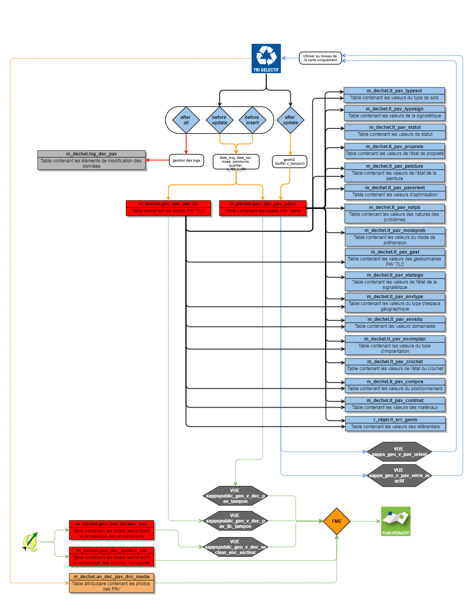
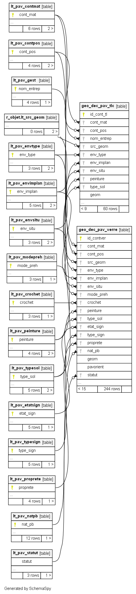

# Documentation d'administration de la base #

* Statut
  - [ ] à rédiger
  - [x] en cours de rédaction
  - [ ] relecture
  - [ ] finaliser
  - [ ] révision

## Principes
 ### Généralité
 
En 2016, une étude d'optimisation de l'implantation des PAV Verre a été initiée sur le territoire de l'Agglomération de la Région de Compiègne avec comme objectif le suivi des PAV sur le terrain en terme de localisation et de données qualitatives. Cette gestion incombant au service déchet de l'Agglomération, une application dédiée au service a été développée par le service SIG. 

Une base de donnée spécifique à cette thématique a été initiée. En plus de ces informations, d'autres données commne les secteurs de collecte des ordures ménagères (zone), des encombrants (par adresse) ainsi que les PAV Textile Linge Chaussure (TLC) ont été intégrées à la base de données.
 
 ### Résumé fonctionnel
 
Pour rappel des grands principes :

* les données des différentes secteurs de ramassage ou de collecte sont gérés par le Sercvice SIG qui met à jour sur demande du servide des déchets
* les données des PAV Verre et TLC (positonnement et données attributaires) sont mises à jour par le Service déchet directement dans l'application métier et les données sont envoyées (la nuit) à l'application Grand Public du Plan Interactif.

## Schéma fonctionnel

## Les droits

#####	Le service des déchets peut :

*	Voir, consulter et rechercher les informations des PAV sur les communes de l’ARC
*	Peut modifier les données sur les PAV Verre et TLC
*	Peut créer un nouveau PAV ou modifier sa localisation

#####	Un autre service peut :

*	Voir, consulter et rechercher les informations d’un PAV sans pouvoir les modifier

###	Les contrôles de saisie

Aucun contrôle de saisies n'a été mis en place. Le service gère sa donnée. Certains champs sont guidés par des listes de valeurs.

## Dépendances

La base de données PEI s'appuie sur des référentiels préexistants constituant autant de dépendances nécessaires pour l'implémentation de la base PEI.

|schéma | table | description | usage |
|:---|:---|:---|:---|   
|r_objet|lt_src_geom|domaine de valeur générique d'une table géographique|source du positionnement du PEI|
|x_apps|geo_vmr_adresse|BAL|Assise des secteurs de ramassage des encombrants|

---

## Classes d'objets

L'ensemble des classes d'objets unitaires sont stockées dans le schéma m_defense_incendie, celles dérivées et applicatives dans le schéma x_apps, celles dérivées pour les exports opendata dans le schéma x_opendata.

### Classe d'objet géographique et patrimoniale

`geo_dec_pav_verre` : table géographique des attributs des PAV Verre.

|Nom attribut | Définition | Type  | Valeurs par défaut |
|:---|:---|:---|:---|  
|id_contver|Identifiant unique géographique|integer|nextval('m_dechet.geo_dec_pav_idconv_seq'::regclass)|"
|commune|libellé de la commune|character varying(30)| |
|insee|numéro insee de la commune|character(5)| |
|quartier|libellé du quartier|character varying(50)| |
|adresse|adresse d'implantation|character varying(80)| |
|x_l93|coordonnée x en lambert 93|double precision| |
|y_l93|coordonnée y en lambert 93|double precision| |
|cont_nbr|nombre de conteneurs|integer| |
|cont_mat|code du matériaux constituant le conteneur (liste de choix lt_pav_contmat)|character varying(2)|'10'::character varying|
|cont_pos|code du type de position du conteneur (liste de choix lt_pav_contpos)|character varying(2)|'10'::character varying|
|date_sai|date de saisie de l'information|timestamp without time zone| |
|date_pos|date de pose|timestamp without time zone| |
|date_net|date de nettoyage|timestamp without time zone| |
|date_maj|date de mise à jour des informations|timestamp without time zone| |
|photo|Nom du fichier de la photo avant la mise à jour de juillet 2016 par le BE RETIF|character varying(254)| |
|url_photo|Lien url vers la photo avant la mise à jour de juillet 2016 par le BE RETIF|character varying(254)| |
|src_geom|code du référentiel spatial de saisie utilisé (liste de choix r_objet.lt_src_geom)|character(2)|'00'::bpchar|
|volume|volume en m3 (par défaut 4)|double precision| |
|env_type|code du type d'espace géographique (liste de choix lt_pav_envtype)|character varying(2)|'00'::character varying|
|env_implan|code du type d'espace urbain d'implantation (liste de choix lt_pav_envimplan)|character varying(2)|'00'::character varying|
|env_situ|code de la situation domaniale (liste de choix lt_pav_envsitu)|character varying(2)|'00'::character varying|
|mode_preh|code du mode de préhension (liste de choix lt_pav_modepreh)|character varying(2)|'10'::character varying|
|crochet|code de l'état du crochet (liste de choix lt_pav_crochet)|character varying(2)|'00'::character varying|
|opercules|Bavettes sur opercules disponibles|boolean| |
|tags|présence de tags|boolean| |
|peinture|code de l'état de la peinture (liste de choix lt_pav_peinture)|character varying(2)|'00'::character varying|
|prox_corb|présence d'une corbeille à proximité|boolean| |
|type_sol|code du type de sol (liste de choix (lt_pav_typesol)|character varying(2)|'00'::character varying|
|trp_rest|présence d'une trappe pour restaurateur|boolean| |
|etat_sign|état de la signalétique (création d'une liste de valeur en fonction de l'état des lieux)|character varying(30)| |
|type_sign|code du type de signalétique (liste de choix lt_pav_typesign)|character varying(2)|'00'::character varying|
|proprete|code de l'état de la propreté (liste de choix lt_pav_proprete)|character varying(2)|'00'::character varying|
|prop_abor|code de l'état de la propreté des abords (liste de choix lt_pav_propabor)|character varying(2)|'00'::character varying|
|def_struc|défaut de structure visible|character varying(30)| |
|hab_pav|Tonnage par gisement d'habitants|integer| |
|opt_pav|nombre de PAV manquant ou excédents par rapport aux préconisation éco-emballages|integer| |
|ame_acces|accéssibilité à revoir|boolean| |
|nat_pb|code de la nature du ou des problèmes (liste de choix lt_pav_natpb)|character varying(2)|'00'::character varying|
|nat_pb_99|précision sur la nature du problème|character varying(500)| |
|geom|champ contenant la géométrie de l'objet|USER-DEFINED| |
|op_sai|Opérateur de saisie de la donnée|character varying(80)| |
|observ|Observations diverses|character varying(500)| |
|pavorient|code des préconisations pour l'amélioration dee emplacements des PAV Verre (suite à l'état des lieux de l'été 2016|character varying(2)| |
|id_parent|identifiant du PAV Verre parent selon les préconisations|integer| |
|statut|code du statut du PAV (actif ou inactif)|character varying(2)| |
|v_tampon|Valeur du tampon correspondant à l'aire de captation du point de ramassage|integer| |
|geom2|Champ contenant la géométrie du tampon d'emprise définit par v_tampon où modifier selon l'influence|USER-DEFINED| |
|date_effet|Date de prise en compte des données dans le plan interactif Grand Public|timestamp without time zone|now()|

  * `t_t1_geo_dec_pav_verre_datemaj` : intégration de la date de mise à jour
  * `t_t2_geo_dec_pav_verre_datesai` : intégration de la date de saisie
  * `t_t3_geo_dec_pav_verre_insee` : intégration du code insee et du nom de la commune 
  * `t_t4_geo_dec_pav_verre_quartier` : intégration du nom du quartier
  * `t_t5_geo_dec_pav_verre_xy` : intégration des valeurs x et y en lambert 93 
  * `t_t6_geo_dec_pav_verre_tampon` : mise à jour du tampon autour du PAV en fonction de la valeur de l'attribut v_tampon   
  * `t_t7_geo_dec_pav_verre_log` : intégration des modifications dans la table des logs 
  
`geo_dec_pav_tlc` : table géographique des attributs des PAV TLC.

|Nom attribut | Définition | Type  | Valeurs par défaut |
|:---|:---|:---|:---|  
|id_cont_tl|identifiant géographique unique|integer|nextval('m_dechet.geo_dec_pav_idconv_seq'::regclass)|"
|commune|libellé de la commune|character varying(50)| |
|insee|code insee de la commune|character(5)| |
|quartier|libellé du quartier|character varying(50)| |
|adresse|adresse|character varying(80)| |
|x_l93|coordonnée x en lambert 93|double precision| |
|y_l93|coordonnée y en lambert 93|double precision| |
|cont_nbr|nombre de conteneurs|integer| |
|cont_mat|code du matériaux constituant le conteneur (liste de choix lt_pav_contmat)|character varying(2)|'10'::character varying|
|cont_pos|code du type de position du conteneur (liste de choix lt_pav_contpos)|character varying(2)|'10'::character varying|
|date_sai|date de la saisie des informations|timestamp without time zone| |
|date_pose|date de pose|timestamp without time zone| |
|date_netoy|date de nettoyage|timestamp without time zone| |
|date_maj|date de mise à jour des informations|timestamp without time zone| |
|nom_entrep|code de l'entreprise gestionnaire du pav (liste de choix lt_pav_gest)|character varying(2)| |
|nom_entrep_99|autre gestionnaire si 99 saisie dans le champ nom_entrep|character varying(30)| |
|photo|libellé du fichier de la photo|character varying(254)| |
|url_photo|lien url de la photo|character varying(254)| |
|src_geom|code du référentiel spatial de saisie utilisé (liste de choix r_objet.lt_scr_geom)|character(2)|'00'::bpchar|
|env_type|code du type d'espace géographique (liste de choix lt_pav_envtype)|character varying(2)|'00'::character varying|
|env_implan|code du type d'espace urbain d'implantation (liste de choix lt_pav_envimplan)|character varying(2)|'00'::character varying|
|env_situ|code de la situation domaniale (liste de choix lt_pav_envsitu)|character varying(2)|'00'::character varying|
|tags|présence de tags|boolean|false|
|peinture|code de l'état de la peinture (liste de choix lt_pav_peinture)|character varying(2)|'00'::character varying|
|prox_corb|présence d'une corbeille à proximité|boolean|false|
|type_sol|code du type de sol (liste de choix (lt_pav_typesol)|character varying(2)|'00'::character varying|
|type_sol_99|autre type de sol si 99 saisie dans le champ type_sol|character varying(30)| |
|geom|champ contenant la géométrie de l'objet|USER-DEFINED| |
|op_sai|Opérateur de saisie de la donnée|character varying(80)| |
|observ|Observations diverses|character varying(500)| |
|v_tampon|Valeur du tampon d'emprise du PAV TLC|integer| |
|geom2|Champ contenant la géométrie du tampon d'emprise définit par v_tampon où modifier selon l'influence|USER-DEFINED| |
|date_effet|Date de prise en compte des données dans le plan interactif Grand Public|timestamp without time zone|now()|

  * `t_t1_geo_dec_pav_tlc_datemaj` : intégration de la date de mise à jour
  * `t_t2_geo_dec_pav_tlc_datesai` : intégration de la date de saisie
  * `t_t3_geo_dec_pav_tlc_insee` : intégration du code insee et du nom de la commune 
  * `t_t4_geo_dec_pav_tlc_quartier` : intégration du nom du quartier
  * `t_t5_geo_dec_pav_tlc_xy` : intégration des valeurs x et y en lambert 93   
  * `t_t6_geo_dec_pav_tlc_log` : intégration des modifications dans la table des logs 

`geo_dec_secteur_enc` : table géographique des secteurs de ramassage des encombrants.

|Nom attribut | Définition | Type  | Valeurs par défaut |
|:---|:---|:---|:---| 
|gid|Identifiant interne|integer|nextval('m_dechet.geo_dec_secteur_enc_seq'::regclass)|"
|insee|Code Insee de la commune|character varying(5)| |
|commune|Libellé de la commune|character varying(150)| |
|op_sai|Opérateur de saisie|character varying(80)| |
|observ|Observation(s)|character varying(254)| |
|src_geom|Référentiel de saisie|character varying(2)| |
|date_sai|Date de saisie|timestamp without time zone| |
|date_maj|Date de mise à jour|timestamp without time zone| |
|adresse|Adresse concernées par un ramassage des encombrants à jour fixe|character varying(254)| |
|l_secteur|Libellé du secteur par rapport au ramssage (fixe ou sur rendez-vous)|character varying(25)| |
|l_message1|Message diffusé sur l'application Grand Public pour les encombrants à jour fixe|character varying(500)| |
|l_message2|Message diffusé sur l'application Grand Public pour les encombrants sur rendez-vous|character varying(500)| |
|geom|Géométrie des points d'adresse à jour fixe|USER-DEFINED| |
|geom1|Géométrie des zones issus des adresses et par défaut les autres (1 seul polygone) sur rendez-vous. Sert dans GEO appli Gd public pour la recherche par adresse|USER-DEFINED| |

`geo_dec_secteur_om` : table géographique des secteurs de ramassage des ordures ménagères.

|Nom attribut | Définition | Type  | Valeurs par défaut |
|:---|:---|:---|:---| 
|gid|Identifiant unique interne|integer|nextval('m_dechet.geo_dec_secteur_om_seq'::regclass)|"
|l_zone|Nom du secteur de ramassage des ordures ménagères|character varying(150)| |
|insee|Code insee de la Commune|character varying(25)| |
|commune|Libellé de la commune|character varying(150)| |
|op_sai|Opérateur de saisie|character varying(80)| |
|observ|Observations|character varying(254)| |
|src_geom|Code de la valeur du référentiel de saisie (lien vers la liste de valeur r_objet.lt_src_geom|character varying(2)|'00'::character varying|
|date_sai|Date de saisie des informations|timestamp without time zone| |
|date_maj|Date de mise à jour des informations|timestamp without time zone| |
|l_fichier|Libellé du fichier avec son extension pour le document lié, ici le calendrier de collecte|character varying(100)| |
|l_message1|Espace pour rédiger un message qui sera intégré dans l'application grand public (plusieurs lignes possibles dans les champs l_message n|character varying(255)| |
|l_message2|2ème ligne du message|character varying(255)| |
|l_message3|3ème ligne du message|character varying(255)| |
|l_message4|4ème ligne du message|character varying(255)| |
|l_message5|5ème ligne du message|character varying(255)| |
|l_message6|6ème ligne du message|character varying(255)| |
|l_message7|7ème ligne du message|character varying(255)| |

### Classe d'objet attributaire et patrimoniale

`an_dec_pav_doc_media` : table attributaire des photos.

|Nom attribut | Définition | Type  | Valeurs par défaut |
|:---|:---|:---|:---|  
|id|Identifiant du PAV|integer| |
|media|Champ Média de GEO|text| |
|miniature|Champ miniature de GEO|bytea| |
|n_fichier|Nom du fichier|text| |
|t_fichier|Type de média dans GEO|text| |
|op_sai|Libellé de l'opérateur ayant intégrer le document|character varying(100)| |
|date_sai|Date d'intégration du document|timestamp without time zone| |
|d_photo|Date de la prise de vue|timestamp without time zone| |
|l_prec|Précision sur le document|character varying(1000)| |

### classes d'objets applicatives de gestion :

Sans objet

---

### classes d'objets applicatives métiers sont classés dans le schéma x_apps :
 
`x_apps.xapps_geo_v_pav_orient` : Vue géométrique des liens entre PAV supprimer, déplacer et le nouvel emplacement
  
`x_apps.xapps_geo_v_pav_verre_inactif` : Vue géographique permettant de visualiser les conteneurs PAV Verre inactifs (dans la cartothèque de l'application GEO sur le tri)

### classes d'objets applicatives grands publics sont classés dans le schéma x_apps_public :

`x_apps_public.xappspublic_geo_v_dec_pav_tampon` : Vue géométrique contenant les tampons d''emprise des conteneurs Verre pour EXPORT FME et recherche des adresse dans ses tampons pour remonter le PAV VERRE

`x_apps_public.xappspublic_geo_v_dec_pav_tlc_tampon` : Vue géométrique contenant les tampons d''emprise des conteneurs TLC pour EXPORT FME et recherche des adresse dans ses tampons pour remonter le PAV VERRE

`x_apps_public.xappspublic_geo_v_dec_secteur_enc_secteur` : Vue géométrique contenant les secteurs de rammassage des encombrants pour export dans GEO APPLI GD PUBLIC

### classes d'objets opendata sont classés dans le schéma x_opendata :

Sans objet

## Liste de valeurs

`lt_pav_contmat` : Liste des types des codes matériaux

|Nom attribut | Définition | Type  | Valeurs par défaut |
|:---|:---|:---|:---|    
|cont_mat|Code matériaux constituant le conteneur|character varying(2)| |
|cont_mat_lib|Libellé des matériaux constituant le conteneur|character varying(30)| |

Particularité(s) à noter : aucune

Valeurs possibles :

|code | valeur | affich
|:---|:---|:---|     
|10|Métal|
|20|Plastique|
|00|Non renseigné|
|21|Plastique + bois|
|30|Résine|
|40|Bois|

---

`lt_pav_contpos` : Liste permettant de décrire les types de position du conteneur'

|Nom attribut | Définition | Type  | Valeurs par défaut |
|:---|:---|:---|:---|    
|cont_pos|code du type de position du conteneur|character varying(2)| |
|cont_pos_lib|libellé du type de position du conteneur|character varying(30)| |

Particularité(s) à noter : aucune

Valeurs possibles :

|code | valeur |
|:---|:---|  
|10|Aérien|
|20|Enterré|
|00|Non renseigné|
|30|Semi-enterré|

---

`lt_pav_crochet` : Liste permettant de décrire l'état du crochet

|Nom attribut | Définition | Type  | Valeurs par défaut |
|:---|:---|:---|:---|    
|crochet|code de l'état du crochet |character varying(2)| |
|crochet_lib|libellé de l'état du crochet |character varying(30)| |

Particularité(s) à noter : aucune

Valeurs possibles :

|code | valeur | code_open |
|:---|:---|:---|   
|10|RAS|
|20|Tordu|
|00|Non renseigné|

---

`lt_pav_envimplan` : Liste permettant de décrire les espaces urbain d'implantation

|Nom attribut | Définition | Type  | Valeurs par défaut |
|:---|:---|:---|:---|    
|env_implan|code du type d'espace urbain d'implantation|character varying(2)| |
|env_implan_lib|libellé du type d'espace urbain d'implantation|character varying(30)| |

Particularité(s) à noter : aucune

Valeurs possibles :

|code | valeur | code_open |
|:---|:---|:---|   
|10|Pavillonnaire|
|20|Collectif|
|00|Non renseigné|
|40|Professionnel|
|30|Mixte (y compris ZI)|

---

`lt_pav_envsitu` : Liste permettant de décrire la situation domaniale

|Nom attribut | Définition | Type  | Valeurs par défaut |
|:---|:---|:---|:---|    
|env_situ|code de la situation domaniale|character varying(2)| |
|env_situ_lib|libellé du type de la situation domaniale|character varying(30)| |

Valeurs possibles :

|code | valeur | 
|:---|:---|   
|10|Terrain privé|
|20|Terrain public|
|00|Non renseigné|

---

`lt_pav_envtype` : Liste permettant de décrire le type d'espace géographique

|Nom attribut | Définition | Type  | Valeurs par défaut |
|:---|:---|:---|:---|    
|env_type|code du type d'espace géographique|character varying(2)| |
|env_type_lib|libellé du type d'espace géographique|character varying(30)| |

Particularité(s) à noter : aucune

Valeurs possibles :

|code | valeur | code_open |
|:---|:---|:---|   
|10|Urbain|
|20|Rural|
|00|Non renseigné|

---

`lt_pav_etatsign` : Liste permettant de décrire l'état de la signalétique

|Nom attribut | Définition | Type  | Valeurs par défaut |
|:---|:---|:---|:---|    
|etat_sign|Code matériaux constituant le conteneur|character varying(2)| |
|etat_sign_lib|Libellé des matériaux constituant le conteneur|character varying(30)| |

Particularité(s) à noter : aucune

Valeurs possibles :

|code | valeur |
|:---|:---|  
|00|Non renseigné|
|10|Correct|
|20|Moyen|
|30|Mauvais|
|40|Incomplet|

---

`lt_pav_gest` : Liste permettant de décrire les festionnaires des PAV TLC

|Nom attribut | Définition | Type  | Valeurs par défaut |
|:---|:---|:---|:---|    
|nom_entrep|code du gestionnaire du PAV TLC|character varying(2)| |
|nom_entrep_lib|Libellé du code du gestionnaire du PAV TLC|character varying(30)| |

Particularité(s) à noter : aucune

Valeurs possibles :

|code | valeur |
|:---|:---|  
|10|Le Relais|
|20|Eco Textile|
|99|Autre|
|00|Non renseigné|

---

`lt_pav_modepreh` : Liste permettant de décrire les modes de préhension

|Nom attribut | Définition | Type  | Valeurs par défaut |
|:---|:---|:---|:---|    
|mode_preh|code du mode de préhension|character varying(2)| |
|mode_preh_lib|libellé du mode de préhension|character varying(30)| |

Valeurs possibles :

|code | valeur | 
|:---|:---|   
|10|Crochet|
|20|Kinshofer|
|00|Non renseigné|

---

`lt_pav_natpb` : Liste permettant de décrire la liste des natures du problème

|Nom attribut | Définition | Type  | Valeurs par défaut |
|:---|:---|:---|:---|    
|nat_pb|code de la nature du ou des problèmes|character varying(2)| |
|nat_pb_lib|Libellé des codes de la nature du ou des problèmes|character varying(30)| |

Particularité(s) à noter : Aucune

Valeurs possibles :

|code | valeur |
|:---|:---|  
|01|Accès restreint|
|02|Arbres|
|03|Lignes aériennes|
|04|Danger|
|05|Excentré|
|06|Marche arrière|
|07|Pas de stationnement|
|08|Sous auvent|
|09|Stationnement gênant|
|10|Virage|
|99|Autre|
|00|Non renseigné|

---

`lt_pav_pavorient` : Liste permettant de décrire les orientations d'optimisation

|Nom attribut | Définition | Type  | Valeurs par défaut |
|:---|:---|:---|:---|    
|pavorient|code de l'orientation du PAV suite à l'état des lieux de l'été 2016|character varying(2)| |
|pavorient_lib|Libellé de l'orientation du PAV suite à l'état des lieux de l'été 2016|character varying(30)| |

Particularité(s) à noter : Aucune

Valeurs possibles :

|code | valeur |
|:---|:---|  
|00|Non renseigné|
|10|A conserver seul|
|20|A renforcer|
|30|A supprimer|
|40|A déplacer|
|50|A créer|

---

`lt_pav_peinture` : Liste permettant de décrire l'état de la peinture

|Nom attribut | Définition | Type  | Valeurs par défaut |
|:---|:---|:---|:---|    
|peinture|code de l'état de la peinture|character varying(2)| |
|peinture_lib|Libellé de l'état de la peinture|character varying(30)| |

Particularité(s) à noter : Aucune

Valeurs possibles :

|code | valeur |
|:---|:---|    
|10|RAS|
|20|Abîmée|
|30|Brûlée|
|00|Non renseigné|

---

`lt_pav_proprete` : Liste permettant de décrire l'état de propreté

|Nom attribut | Définition | Type  | Valeurs par défaut |
|:---|:---|:---|:---|    
|proprete|code de l'état de la propreté|character varying(2)| |
|proprete_lib|Libellé code de l'état de la propreté|character varying(30)| |

Particularité(s) à noter : Aucune

Valeurs possibles :

|code | valeur |
|:---|:---|    
|10|Propre|
|20|Moyen|
|30|Sale|
|00|Non renseigné|

---

`lt_pav_statut` : Liste permettant de décrire le statut

|Nom attribut | Définition | Type  | Valeurs par défaut |
|:---|:---|:---|:---|    
|statut|code du statut|character varying(2)| |
|statut_lib|Libellé du statut|character varying(30)| |

Particularité(s) à noter : Aucune

Valeurs possibles :

|code | valeur |
|:---|:---|    
|00|Non renseigné|
|10|Actif|
|20|Inactif (projet, existe plus)|

---

`lt_pav_typesign` : Liste permettant de décrire la signalétique

|Nom attribut | Définition | Type  | Valeurs par défaut |
|:---|:---|:---|:---|    
|type_sign|code du type de signalétique|character varying(2)| |
|type_sign_lib|Libellé du type de signalétique|character varying(30)| |

Particularité(s) à noter : Aucune

Valeurs possibles :

|code | valeur |
|:---|:---|    
|10|Adhésif|
|20|Totem|
|30|Covering|
|00|Non renseigné|
|40|Plaque + adhésif|

---

`lt_pav_typesol` : Liste permettant de décrire le type de sol

|Nom attribut | Définition | Type  | Valeurs par défaut |
|:---|:---|:---|:---|
|type_sol|code du type de sol|character varying(2)| |
|type_sol_lib|Libellé du type de sol|character varying(30)| |

Particularité(s) à noter : Aucune

Valeurs possibles :

|code | valeur |
|:---|:---|    
|10|Dalle|
|20|Bitume|
|30|Terre|
|99|Autre|
|00|Non renseigné|

---

## Log

`log_dec_pav` : table attributaire des logs.

|Nom attribut | Définition | Type  | Valeurs par défaut |
|:---|:---|:---|:---|  
|gid|identifiant unique|integer| |
|objet|Type de modification (update, delete, insert)|character varying(10)| |
|d_maj|Date de l'exécution de la modification|timestamp without time zone| |
|user|Utilisateur ayant exécuté l'exécution|character varying(50)| |
|relid|ID d'objet de la table qui a causé le déclenchement.|character varying(255)| |
|l_schema|Libellé du schéma contenant la table ou la vue exécutée ou mlodifiée|character varying(30)| |
|l_table|Libellé de la table exécutée|character varying(30)| |
|idgeo|Identifiant unique de l'objet de la table correspondante|character varying(100)| |
|geom|Champ contenant la géométrie des objets polygones modifiés ou supprimés|USER-DEFINED| |

Particularité(s) à noter : Aucune

## Erreur

Sans objet

---

## Projet QGIS pour la gestion

Sans objet

## Traitement automatisé mis en place (Workflow de l'ETL FME)

### Initialisation des données - Etat 0

Sans objet

### Mise à jour des données

Sans objet

## Export Grand Public

Cet export est géré dans le Workflow global d'envoi des données à la base déportée de GEO pour l'alimentation de l'application Plan Intéractif.
Y:\Ressources\4-Partage\3-Procedures\FME\prod\APPS_GB_PUBLIC\PLAN_INTERACTIF.fmw

## Export Open Data

Sans objet

---

## Schéma fonctionnel

### Modèle conceptuel simplifié

