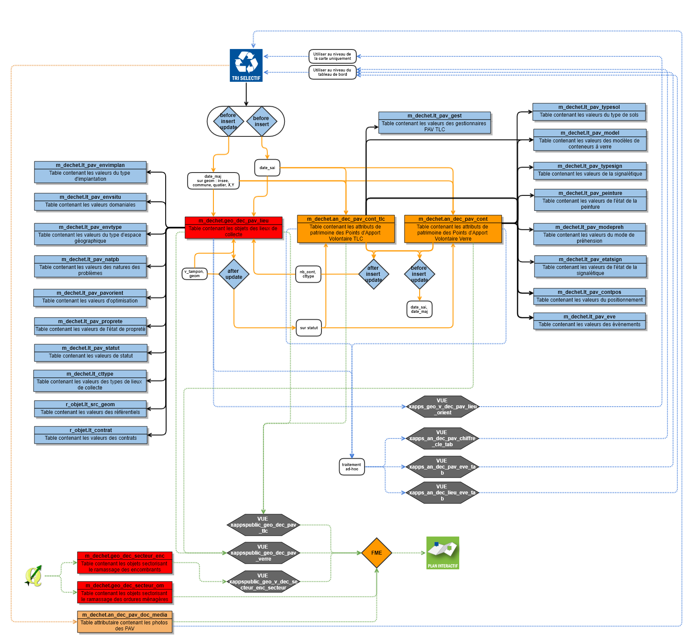
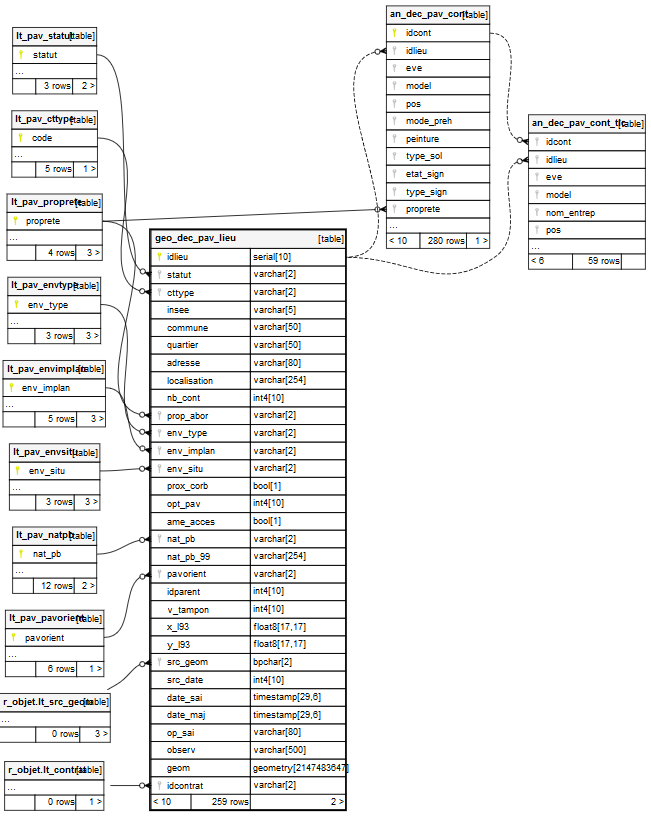

# Documentation d'administration de la base de données des déchets #

## Principes
 ### Généralité
 
En 2016, une étude d'optimisation de l'implantation des PAV Verre a été initiée sur le territoire de l'Agglomération de la Région de Compiègne avec comme objectif le suivi des PAV sur le terrain en terme de localisation et de données qualitatives. Cette gestion incombant au service déchet de l'Agglomération, une application dédiée au service a été développée par le service SIG. 

Une base de donnée spécifique à cette thématique a été initiée. En plus de ces informations, d'autres données commne les secteurs de collecte des ordures ménagères (zone), des encombrants (par adresse) ainsi que les PAV Textile Linge Chaussure (TLC) ont été intégrées à la base de données.

En 2021, à l'occasion du renouvellement de la gestion du patrimoine des Points d'Apport Volontaire Verre, cette base de données a été révisée pour mieux appréhender les problématiques liés aux lieux de collecte et à la perspective de centraliser les données provenant du gestionnaire (statistique de tonnage, ...).
 
 ### Résumé fonctionnel
 
Pour rappel des grands principes :

* les données des différentes secteurs de ramassage ou de collecte sont gérés par le Sercvice SIG qui met à jour sur demande du servide des déchets
* les données des PAV Verre et TLC (positonnement et données attributaires) sont mises à jour par le Service déchet directement dans l'application métier et les données sont envoyées (la nuit) à l'application Grand Public du Plan Interactif.

## Schéma fonctionnel

## Dépendances

La base de données des dédchets s'appuie sur des référentiels préexistants constituant autant de dépendances nécessaires pour l'implémentation de la base PEI.

|schéma | table | description | usage |
|:---|:---|:---|:---|   
|r_objet|lt_src_geom|domaine de valeur générique d'une table géographique|source du positionnement du PEI|
|x_apps|geo_vmr_adresse|BAL|Assise des secteurs de ramassage des encombrants|
|r_objet|lt_contrat|liste et caractéristiques des contrats de délégation|Gestion des différents données de réseau ou s'apparentant un contrat|

---

## Classes d'objets

L'ensemble des classes d'objets unitaires sont stockées dans le schéma m_dechet, celles dérivées et applicatives dans le schéma `x_apps`, celles dérivées pour les exports opendata dans le schéma `x_opendata` et celles dérivées pour l'exploitation dans l'application Grand Public Plan Interactif dansle schéma `x_apps_public`.

### Classe d'objet géographique et patrimoniale

`geo_dec_pav_lieu` : table géographique des lieux de collecte.

|Nom attribut | Définition | Type  | Valeurs par défaut |
|:---|:---|:---|:---|  
|idlieu|Identifiant unique du lieu de collecte|integer|nextval('m_dechet.geo_dec_pav_lieu_idlieu_seq'::regclass)|
|statut|Statut du lieu du collecte (liste de valeurs lt_pav_statut)|character varying(2)| |
|cttype|Type de conteneur (liste de valeurs lt_pav_cctype). Attribut automatisé en fonction des conteneurs présents au lieu|character varying(2)| |
|insee|Code insee de la commune d'implantation du lieu|character varying(5)| |
|commune|Libellé de la commune d'implantation du lieu|character varying(50)| |
|quartier|Libellé du quartier d'implantation du lieu (ville de Compiègne uniquement)|character varying(50)| |
|adresse|Libellé de l'adresse proche du lieu|character varying(80)| |
|localisation|Information complémentaire à l'adresse pour mieux appréhender la localisation du lieu|character varying(254)| |
|nb_cont|Nombre de conteneurs Verre présent au lieu. Cet attribut est calculé automatiquement à la mise à jour des conteneurs|integer| |
|prop_abor|Propreté aux abords du lieu (liste de valeurs lt_pav_proprete)|character varying(2)| |
|env_type|Type d'environnement autour du lieu (liste de valeurs lt_pav_envtype)|character varying(2)| |
|env_implan|Environnement d'implantation du lieu (liste de valeurs lt_pav_envimplan)|character varying(2)| |
|env_situ|Situation du lieu (liste de valeurs lt_pav_envsitu)|character varying(2)| |
|prox_corb|Présence d'une corbeille à proximité du lieu|boolean| |
|opt_pav|nombre de PAV manquant ou excédents par rapport aux préconisation éco-emballages|integer| |
|ame_acces|Accéssibilité à revoir|boolean| |
|nat_pb|Nature des problèmes identifiés au lieu (liste de valeurs lt_pav_natpb)|character varying(2)| |
|nat_pb_99|Autre type de problème identifié au lieu|character varying(254)| |
|pavorient|Préconisations pour l'amélioration des emplacements des lieux (suite à l'état des lieux de l'été 2016) (liste de valeurs lt_pav_pavorient)|character varying(2)| |
|idparent|Identifient du lieu parent|integer| |
|v_tampon|Valeur en mètre de l'aire de chalandise du lieu|integer| |
|x_l93|Coordonnée X en Lambert 93 du lieu|double precision| |
|y_l93|Coordonnée Y en Lambert 93 du lieu|double precision| |
|src_geom|Référentiel de saisie utilisé pour saisir le lieu (liste de valeurs r_objet.lt_src_geom)|character(2)| |
|src_date|Année du référentiel de saisi pour la saisie des lieux|integer| |
|date_sai|Date de saisie initiale du lieu|timestamp without time zone| |
|date_maj|Date de mise à jour de la donnée|timestamp without time zone| |
|op_sai|Opérateur de saisie|character varying(80)| |
|observ|Observations diverses|character varying(500)| |
|geom|Attribut de géométrie|USER-DEFINED| |
|idcontrat|Identifiant du contrat de gestion du ramassage des conteneurs Verre (liste de valeurs r_objet.lt_contrat)|character varying(2)| |

* triggers :

  * `t_t1_geo_dec_pav_lieu_datemaj` : intégration de la date de mise à jour
  
  * `t_t2_geo_dec_pav_lieu_datesai` : intégration de la date de saisie
  
  * `t_t3_geo_dec_pav_lieu_insee` : intégration du code insee et du nom de la commune 
  
  * `t_t4_geo_dec_pav_lieu_quartier` : intégration du nom du quartier
  
  * `t_t5_geo_dec_pav_lieu_xy` : intégration des valeurs x et y en lambert 93 
  
  * `t_t6_geo_dec_pav_lieu_tampon` : Fonction trigger pour mise à jour du tampon d''emprise du lieu de collecte si v_tampon est modifiée 
  
  * `t_t7_geo_dec_pav_lieu_delete` : Fonction trigger pour automatiser la dépose de tous les conteneurs lorsque le lieu de collecte devient inactif
  
`geo_dec_secteur_enc` : table géographique des secteurs de ramassage des encombrants.

|Nom attribut | Définition | Type  | Valeurs par défaut |
|:---|:---|:---|:---| 
|gid|Identifiant interne|integer|nextval('m_dechet.geo_dec_secteur_enc_seq'::regclass)|"
|insee|Code Insee de la commune|character varying(5)| |
|commune|Libellé de la commune|character varying(150)| |
|op_sai|Opérateur de saisie|character varying(80)| |
|observ|Observation(s)|character varying(254)| |
|src_geom|Référentiel de saisie|character varying(2)| |
|date_sai|Date de saisie|timestamp without time zone| |
|date_maj|Date de mise à jour|timestamp without time zone| |
|adresse|Adresse concernées par un ramassage des encombrants à jour fixe|character varying(254)| |
|l_secteur|Libellé du secteur par rapport au ramssage (fixe ou sur rendez-vous)|character varying(25)| |
|l_message1|Message diffusé sur l'application Grand Public pour les encombrants à jour fixe|character varying(500)| |
|l_message2|Message diffusé sur l'application Grand Public pour les encombrants sur rendez-vous|character varying(500)| |
|geom|Géométrie des points d'adresse à jour fixe|USER-DEFINED| |
|geom1|Géométrie des zones issus des adresses et par défaut les autres (1 seul polygone) sur rendez-vous. Sert dans GEO appli Gd public pour la recherche par adresse|USER-DEFINED| |

`geo_dec_secteur_om` : table géographique des secteurs de ramassage des ordures ménagères.

|Nom attribut | Définition | Type  | Valeurs par défaut |
|:---|:---|:---|:---| 
|gid|Identifiant unique interne|integer|nextval('m_dechet.geo_dec_secteur_om_seq'::regclass)|"
|l_zone|Nom du secteur de ramassage des ordures ménagères|character varying(150)| |
|insee|Code insee de la Commune|character varying(25)| |
|commune|Libellé de la commune|character varying(150)| |
|op_sai|Opérateur de saisie|character varying(80)| |
|observ|Observations|character varying(254)| |
|src_geom|Code de la valeur du référentiel de saisie (lien vers la liste de valeur r_objet.lt_src_geom|character varying(2)|'00'::character varying|
|date_sai|Date de saisie des informations|timestamp without time zone| |
|date_maj|Date de mise à jour des informations|timestamp without time zone| |
|l_fichier|Libellé du fichier avec son extension pour le document lié, ici le calendrier de collecte|character varying(100)| |
|l_message1|Espace pour rédiger un message qui sera intégré dans l'application grand public (plusieurs lignes possibles dans les champs l_message n|character varying(255)| |
|l_message2|2ème ligne du message|character varying(255)| |
|l_message3|3ème ligne du message|character varying(255)| |
|l_message4|4ème ligne du message|character varying(255)| |
|l_message5|5ème ligne du message|character varying(255)| |
|l_message6|6ème ligne du message|character varying(255)| |
|l_message7|7ème ligne du message|character varying(255)| |

### Classe d'objet attributaire et patrimoniale

`an_dec_pav_cont` : table attributaire des Points d'Apport Volontaire Verre.

|Nom attribut | Définition | Type  | Valeurs par défaut |
|:---|:---|:---|:---|  
|idcont|Identifiant unique du conteneur Verre (valeur par défaut de la clé à restaurer après migration finale des données, (nextval('m_dechet.an_dec_pav_cont_idcont_seq'::regclass)) )|integer|nextval('m_dechet.an_dec_pav_cont_idcont_seq'::regclass)|
|idlieu|Identifiant du lieu de collecte|integer| |
|idpresta|Identifiant du conteneur du prestataire|character varying(10)| |
|eve|Evènement lié à la vie du conteneur (liste de valeurs lt_pav_eve)|character varying(2)| |
|model|Modèle du conteneur Verre (liste de valeurs lt_pav_modele)|integer| |
|pos|Position du conteneur Verre (liste de valeurs lt_pav_pos)|character varying(2)| |
|date_sai|Date de saisie de la donnée|timestamp without time zone| |
|date_maj|Date de mise à jour de la donnée|timestamp without time zone| |
|date_pos|Date de pose|timestamp without time zone| |
|date_net|Date du dernier nettoyage|timestamp without time zone| |
|date_effet|Date de prise en compte des données dans le plan interactif Grand Public|timestamp without time zone| |
|mode_preh|Mode de préhension du conteneur Verre|character varying(2)| |
|opercules|Présence d'opercules sur le conteneur Verre|boolean| |
|tags|Présence de tags sur le conteneur|boolean| |
|peinture|Etat de la peinture du conteneur Verre (liste de valeurs lt_pav_peinture)|character varying(2)| |
|type_sol|Type de sol sur lequel est posé le conteneur Verre (liste de valeurs lt_pav_typesol)|character varying(2)| |
|trp_rest|Présence d'une trappe pour restaurateur|boolean| |
|etat_sign|Etat de la signalétique sur le conteneur Verre (liste de valeurs lt_pav_etatsign)|character varying(2)| |
|type_sign|Type de signalétique présente sur le conteneur Verre (liste de valeurs lt_pav_typesign)|character varying(2)| |
|proprete|Etat de propreté du conteneur Verre (liste de valeurs lt_pav_proprete)|character varying(2)| |
|def_struc|Présence de défaut de structure|boolean| |
|op_sai|Opérateur de saisie initial du conteneur|character varying(80)| |
|observ|Observations diverses|character varying(500)| |
|date_eve|Date du dernier évènement intervenu sur le conteneur Verre|timestamp without time zone| |
|obs_eve|Observations liées à l'évènement|character varying(500)| |

* triggers :

  * `t_t1_an_dec_pav_cont_lieu` : Fonction trigger pour mise à jour lieu de collecte (nb de conteneur verre et type de lieu)
  
  * `t_t2_an_dec_pav_cont_datemaj` : intégration de la date de mise à jour
  
  * `t_t3_an_dec_pav_cont_datesai` : intégration de la date de saisie

`an_dec_pav_cont_tlc` : table attributaire des Points d'Apport Volontaire TLC.

|Nom attribut | Définition | Type  | Valeurs par défaut |
|:---|:---|:---|:---| 
|idcont|Identifiant unique du conteneur TLC
(nextval('m_dechet.an_dec_pav_cont_idcont_seq'::regclass) )|integer|nextval('m_dechet.an_dec_pav_cont_idcont_seq'::regclass)|
|idlieu|Identifiant du lieu de collecte|integer| |
|eve|Evènement intervenu sur le conteneur TLC (liste de valeurs lt_pav_eve)|character varying(2)| |
|model|Modèle du conteneur (liste de valeurs lt_pav_modele)|integer| |
|nom_entrep|Nom de l'entreprise gestionnaire du conteneur (liste de valeurs lt_pav_gest)|character varying(2)| |
|nom_entrep_99|Autre entreprise gestionnaire si non présente das nom_entrep|character varying(80)| |
|pos|Position du conteneur TLC (liste de valeurs lt_pav_pos)|character varying(2)| |
|date_sai|Date de saisie initiale|timestamp without time zone| |
|date_maj|Date de mise à jour de la donnée|timestamp without time zone| |
|date_pos|Date de pose du conteneur TLC|timestamp without time zone| |
|date_effet|Date de prise en compte dans l'application Grand Public Plan Interactif |timestamp without time zone| |
|op_sai|Opérateur de saisie initiale de la donnée|character varying(80)| |
|observ|Observations diverses|character varying(500)| |
|date_eve|Date du dernier évènement intervenu sur le conteneur TLC|timestamp without time zone| |
|obs_eve|Observations liées à l'évènement|character varying(500)| |

* triggers :

  * `t_t1_an_dec_pav_cont_lieu` : Fonction trigger pour mise à jour lieu de collecte (nb de conteneur verre et type de lieu)
  
  * `t_t2_an_dec_pav_cont_datemaj` : intégration de la date de mise à jour
  
  * `t_t3_an_dec_pav_cont_datesai` : intégration de la date de saisie
  
`an_dec_pav_doc_media` : table attributaire gérant les documents joints au lieu de collecte.

|Nom attribut | Définition | Type  | Valeurs par défaut |
|:---|:---|:---|:---| 
|id|Identifiant du PAV|integer| |
|media|Champ Média de GEO|text| |
|miniature|Champ miniature de GEO|bytea| |
|n_fichier|Nom du fichier|text| |
|t_fichier|Type de média dans GEO|text| |
|op_sai|Libellé de l'opérateur ayant intégrer le document|character varying(100)| |
|date_sai|Date d'intégration du document|timestamp without time zone| |
|d_photo|Date de la prise de vue|timestamp without time zone| |
|l_prec|Précision sur le document|character varying(1000)| |
|t_doc|Type de document|character varying(2)|0|

* triggers :

* `t_t1_an_dec_pav_doc_media_date_sai` : Intégration de la date d'intégration du document
  
`an_dec_pav_model_media` : table attributaire gérant les photos des modèles de PAV Verre ou TLC.

|Nom attribut | Définition | Type  | Valeurs par défaut |
|:---|:---|:---|:---| 
|id|Identifiant du PAV|integer| |
|media|Champ Média de GEO|text| |
|miniature|Champ miniature de GEO|bytea| |
|n_fichier|Nom du fichier|text| |
|t_fichier|Type de média dans GEO|text| |
|op_sai|Libellé de l'opérateur ayant intégrer le document|character varying(100)| |
|date_sai|Date d'intégration du document|timestamp without time zone| |

* triggers :

  * `t_t1_an_dec_pav_model_media_date_sai` : Intégration de la date d'intégration du document
  
### classes d'objets applicatives de gestion :

Sans objet

---

### classes d'objets applicatives métiers sont classés dans le schéma x_apps :
 
`x_apps.xapps_geo_v_dec_pav_lieu_orient` : Vue géométrique des liens entre les lieux de collecte supprimés, déplacés (nouvel emplacement)

`x_apps.xapps_an_dec_lieu_eve_tab` : Vue alphanumérique présentant les évènements par année des mouvements des lieux de collecte disposant de PAV Verre 

`x_apps.xapps_an_dec_pav_chiffre_cle_tab` : Vue alphanumérique présentant les chiffrss clés sur les PAV Verre

`x_apps.xapps_an_dec_pav_eve_tab` : Vue alphanumérique présentant les évènements par année des mouvements de PAV Verre

### classes d'objets applicatives grands publics sont classés dans le schéma x_apps_public :

`x_apps_public.xappspublic_geo_dec_pav_verre` : Vue géographique présentant les données servant à l''export pour l''appli Gd Public des conteneurs verres 

`x_apps_public.xappspublic_geo_dec_pav_tlc` : Vue géographique présentant les données servant à l''export pour l''appli Gd Public des conteneurs TLC

`x_apps_public.xappspublic_geo_v_dec_secteur_enc_secteur` : Vue géométrique contenant les secteurs de rammassage des encombrants pour export dans GEO APPLI GD PUBLIC

### classes d'objets opendata sont classés dans le schéma x_opendata :

(à produire)

## Liste de valeurs

`lt_pav_contpos` : Liste permettant de décrire les types de position du conteneur'

|Nom attribut | Définition | Type  | Valeurs par défaut |
|:---|:---|:---|:---|    
|code|code du type de position du conteneur|character varying(2)| |
|valeur|libellé du type de position du conteneur|character varying(30)| |

Particularité(s) à noter : aucune

Valeurs possibles :

|code | valeur |
|:---|:---|  
|10|Aérien|
|20|Enterré|
|00|Non renseigné|
|30|Semi-enterré|

---

`lt_pav_cttype` : Liste de valeurs des codes du type de lieux de collecte

|Nom attribut | Définition | Type  | Valeurs par défaut |
|:---|:---|:---|:---|    
|code|code du type de lieu|character varying(2)| |
|valeur|Libellé du type de lieu|character varying(30)| |

Particularité(s) à noter : aucune

Valeurs possibles :

|code | valeur | code_open |
|:---|:---|:---|   
|00|Non renseigné|
|10|Verre|
|20|TLC|
|30|Verre et TLC|
|40|Aucun|

---

`lt_pav_envimplan` : Liste permettant de décrire les espaces urbain d'implantation

|Nom attribut | Définition | Type  | Valeurs par défaut |
|:---|:---|:---|:---|    
|code|code du type d'espace urbain d'implantation|character varying(2)| |
|valeur|libellé du type d'espace urbain d'implantation|character varying(30)| |

Particularité(s) à noter : aucune

Valeurs possibles :

|code | valeur | code_open |
|:---|:---|:---|   
|10|Pavillonnaire|
|20|Collectif|
|00|Non renseigné|
|40|Professionnel|
|30|Mixte (y compris ZI)|

---

`lt_pav_envsitu` : Liste permettant de décrire la situation domaniale

|Nom attribut | Définition | Type  | Valeurs par défaut |
|:---|:---|:---|:---|    
|code|code de la situation domaniale|character varying(2)| |
|valeur|libellé du type de la situation domaniale|character varying(30)| |

Valeurs possibles :

|code | valeur | 
|:---|:---|   
|10|Terrain privé|
|20|Terrain public|
|00|Non renseigné|

---

`lt_pav_envtype` : Liste permettant de décrire le type d'espace géographique

|Nom attribut | Définition | Type  | Valeurs par défaut |
|:---|:---|:---|:---|    
|code|code du type d'espace géographique|character varying(2)| |
|valeur|libellé du type d'espace géographique|character varying(30)| |

Particularité(s) à noter : aucune

Valeurs possibles :

|code | valeur | code_open |
|:---|:---|:---|   
|10|Urbain|
|20|Rural|
|00|Non renseigné|

---

`lt_pav_etatsign` : Liste permettant de décrire l'état de la signalétique

|Nom attribut | Définition | Type  | Valeurs par défaut |
|:---|:---|:---|:---|    
|code|Code des états de la signalétique|character varying(2)| |
|valeur|Libellé des états de la signalétique|character varying(30)| |

Particularité(s) à noter : aucune

Valeurs possibles :

|code | valeur |
|:---|:---|  
|00|Non renseigné|
|10|Correct|
|20|Moyen|
|30|Mauvais|
|40|Incomplet|

---

`lt_pav_eve` : Liste de valeurs des évènements

|Nom attribut | Définition | Type  | Valeurs par défaut |
|:---|:---|:---|:---|    
|code|code de l'évènement du conteneur|character varying(2)| |
|valeur|Libellé de l'évènement|character varying(50)| |

Particularité(s) à noter : aucune

Valeurs possibles :

|code | valeur |
|:---|:---|  
|00|Non renseigné|
|10|Ajout (initialisation de la base de donnée)|
|11|Ajout (nouveau lieu de collecte)|
|13|Ajout (pour un complément)|
|20|Déposé|
|30|Remplacé (à l'identique)|
|31|Remplacé (par un autre modèle)|
|12|Ajout (dû à un remplacement)|
|21|Déposé (suppression du lieu de collecte)|
|14|Ajout (dû à un déplacement du lieu de collecte)|

---

`lt_pav_gest` : Liste permettant de décrire les festionnaires des PAV TLC

|Nom attribut | Définition | Type  | Valeurs par défaut |
|:---|:---|:---|:---|    
|code|code du gestionnaire du PAV TLC|character varying(2)| |
|valeur|Libellé du code du gestionnaire du PAV TLC|character varying(30)| |

Particularité(s) à noter : aucune

Valeurs possibles :

|code | valeur |
|:---|:---|  
|10|Le Relais|
|20|Eco Textile|
|99|Autre|
|00|Non renseigné|

---

`lt_pav_modele` : Liste de valeurs des modèles de conteneur

|Nom attribut | Définition | Type  | Valeurs par défaut |
|:---|:---|:---|:---|    
|code|code du modèle|integer|nextval('m_dechet.lt_pav_model_code_seq'::regclass)|
|valeur|Libellé du conteneur|character varying(50)| |
|volume|Volume en mètre cube|integer| |
|matériau|Matériau principal du conteneur|character varying(20)| |

Particularité(s) à noter : aucune

Valeurs possibles :

|code | valeur | volume |matériau |
|:---|:---|:---|:---|
|0|Non renseigné|||
|1|TEMACO - MULTIPACK C600 4m3|4|Acier|
|2|COLLECTAL-VILLIGERS City Line 4m3|4|Acier|
|3|TEMACO - PO MULTIPACK C600 4m3|4|Acier|
|4|SULO-CITY BULLE 4m3|4|Plastique|
|5|UTPM 3m3|3|Plastique|
|6|MULTIPACK ENTERRE PO - 4m3|4|Acier|
|7|EcoNox Classique (rouleau simple)|3|Acier|
|8|EcoNox Classique (rouleau double)|6|Acier|
|9|EcoNox Bunker (mini)|2|Acier|
|10|EcoNox Bunker (Demi)|4|Acier|
|11|EcoNox Bunker (Bunker)|8|Acier|
|12|EcoNox Eco ZR|2,2|Acier|eco_zr.jpg|https://geo.compiegnois.fr/documents/metiers/env/dechet/model_pav/eco_zr.jpg|
|99|Autre|||

---

`lt_pav_modepreh` : Liste permettant de décrire les modes de préhension

|Nom attribut | Définition | Type  | Valeurs par défaut |
|:---|:---|:---|:---|    
|code|code du mode de préhension|character varying(2)| |
|valeur|libellé du mode de préhension|character varying(30)| |

Valeurs possibles :

|code | valeur | 
|:---|:---|   
|10|Crochet|
|20|Kinshofer|
|00|Non renseigné|

---

`lt_pav_natpb` : Liste permettant de décrire la liste des natures du problème

|Nom attribut | Définition | Type  | Valeurs par défaut |
|:---|:---|:---|:---|    
|code|code de la nature du ou des problèmes|character varying(2)| |
|valeur|Libellé des codes de la nature du ou des problèmes|character varying(30)| |

Particularité(s) à noter : Aucune

Valeurs possibles :

|code | valeur |
|:---|:---|  
|01|Accès restreint|
|02|Arbres|
|03|Lignes aériennes|
|04|Danger|
|05|Excentré|
|06|Marche arrière|
|07|Pas de stationnement|
|08|Sous auvent|
|09|Stationnement gênant|
|10|Virage|
|99|Autre|
|00|Non renseigné|

---

`lt_pav_pavorient` : Liste permettant de décrire les orientations d'optimisation

|Nom attribut | Définition | Type  | Valeurs par défaut |
|:---|:---|:---|:---|    
|code|code de l'orientation du PAV suite à l'état des lieux de l'été 2016|character varying(2)| |
|valeur|Libellé de l'orientation du PAV suite à l'état des lieux de l'été 2016|character varying(30)| |

Particularité(s) à noter : Aucune

Valeurs possibles :

|code | valeur |
|:---|:---|  
|00|Non renseigné|
|10|A conserver seul|
|20|A renforcer|
|30|A supprimer|
|40|A déplacer|
|50|A créer|

---

`lt_pav_peinture` : Liste permettant de décrire l'état de la peinture

|Nom attribut | Définition | Type  | Valeurs par défaut |
|:---|:---|:---|:---|    
|code|code de l'état de la peinture|character varying(2)| |
|valeur|Libellé de l'état de la peinture|character varying(30)| |

Particularité(s) à noter : Aucune

Valeurs possibles :

|code | valeur |
|:---|:---|    
|10|RAS|
|20|Abîmée|
|30|Brûlée|
|00|Non renseigné|

---

`lt_pav_proprete` : Liste permettant de décrire l'état de propreté

|Nom attribut | Définition | Type  | Valeurs par défaut |
|:---|:---|:---|:---|    
|code|code de l'état de la propreté|character varying(2)| |
|valeur|Libellé code de l'état de la propreté|character varying(30)| |

Particularité(s) à noter : Aucune

Valeurs possibles :

|code | valeur |
|:---|:---|    
|10|Propre|
|20|Moyen|
|30|Sale|
|00|Non renseigné|

---

`lt_pav_statut` : Liste permettant de décrire le statut

|Nom attribut | Définition | Type  | Valeurs par défaut |
|:---|:---|:---|:---|    
|code|code du statut|character varying(2)| |
|valeur|Libellé du statut|character varying(30)| |

Particularité(s) à noter : Aucune

Valeurs possibles :

|code | valeur |
|:---|:---|    
|00|Non renseigné|
|10|Actif|
|20|Inactif (projet, existe plus)|

---

`lt_pav_typesign` : Liste permettant de décrire la signalétique

|Nom attribut | Définition | Type  | Valeurs par défaut |
|:---|:---|:---|:---|    
|code|code du type de signalétique|character varying(2)| |
|valeur|Libellé du type de signalétique|character varying(30)| |

Particularité(s) à noter : Aucune

Valeurs possibles :

|code | valeur |
|:---|:---|    
|10|Adhésif|
|20|Totem|
|30|Covering|
|00|Non renseigné|
|40|Plaque + adhésif|

---

`lt_pav_typesol` : Liste permettant de décrire le type de sol

|Nom attribut | Définition | Type  | Valeurs par défaut |
|:---|:---|:---|:---|
|code|code du type de sol|character varying(2)| |
|valeur|Libellé du type de sol|character varying(30)| |

Particularité(s) à noter : Aucune

Valeurs possibles :

|code | valeur |
|:---|:---|    
|10|Dalle|
|20|Bitume|
|30|Terre|
|99|Autre|
|00|Non renseigné|

---

## Log

(à revoir)

## Erreur

Sans objet

---

## Projet QGIS pour la gestion

Sans objet (uniquement un projet QGis pour le gabarit de mise à jour)

## Traitement automatisé mis en place (Workflow de l'ETL FME)

### Initialisation des données - Etat 0

Sans objet

### Mise à jour des données

(à produire pour une mise à jour ponctuelle d'un producteur à travers le gabarit)

## Export Grand Public

Cet export est géré dans le Workflow global d'envoi des données à la base déportée de GEO pour l'alimentation de l'application Plan Intéractif.
Y:\Ressources\4-Partage\3-Procedures\FME\prod\APPS_GB_PUBLIC\PLAN_INTERACTIF.fmw

## Export Open Data

Sans objet

---

## Schéma fonctionnel

### Modèle conceptuel simplifié des lieux de collecte des Points d'Apport Volontaire

